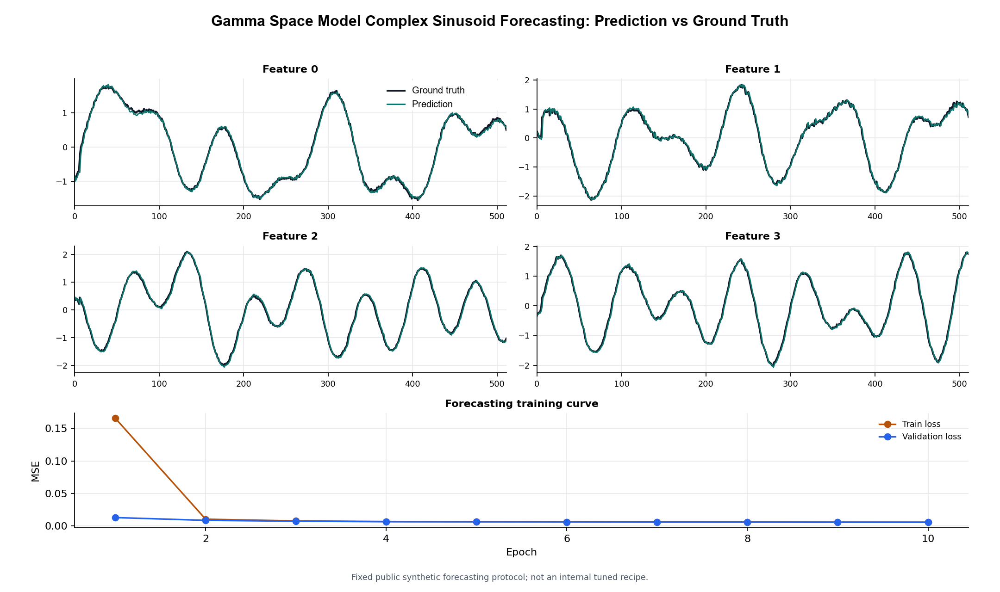

# Gamma Space Model Public Standard Benchmarks

These results use a fixed public demonstration protocol for Gamma Space Model. The run
was performed in Google Colab using the public `GammaSpaceModel` package.

The goal of this benchmark page is to show behavior on recognizable sequence
modeling tasks while keeping internal ablations, private experiment notebooks,
and comparison records out of the public release.

## Run Context

| Field | Value |
|---|---|
| Protocol | `gamma_space_model_public_standard_v1` |
| Model profile | `fixed_public_demo_profile` |
| Full run | `true` |
| Device | `cuda` |
| PyTorch | `2.10.0+cu128` |
| CUDA | `12.8` |

## Shared Model Configuration

The same Gamma Space Model stack profile is used across all tasks; only task-specific
input and output heads differ.

| Hyperparameter | Value |
|---|---:|
| `d_model` | 64 |
| `hidden_dim` | 128 |
| `num_layers` | 2 |

### GammaSpaceBlock Configuration

The benchmark constructs each layer as `GammaSpaceBlock(d_model=64,
hidden_dim=128)`, so the public package defaults below are used for the rest of
the block configuration.

| Hyperparameter | Value |
|---|---:|
| `dt_min` | 0.001 |
| `dt_max` | 0.1 |
| `dt_init` | 0.01 |
| `discretization` | `bilinear` |
| `prenorm` | `true` |
| `residual_scale` | 1.0 |
| `dropout` | 0.0 |
| `activation` | `gelu` |
| `gate` | `true` |
| `use_D` | `true` |
| `kernel_mode` | `auto` |
| `kernel_threshold` | 64 |
| `use_output_linear` | `true` |
| `gate_bias` | 2.0 |
| `input_gate` | `true` |
| `input_gate_bias` | 2.0 |
| `layer_scale_init` | 0.1 |

## Shared Training Configuration

| Hyperparameter | Value |
|---|---:|
| `epochs` | 10 |
| `batch_size` | 64 |
| `lr` | 0.001 |
| `weight_decay` | 0.0 |
| `grad_clip` | 1.0 |

## Task Configurations

| Task | Type | Configuration |
|---|---|---|
| `complex_sinusoid_forecasting` | Time forecasting | `train_samples=8192`, `val_samples=1024`, `sequence_length=512`, `features=8`, `components=5`, `noise_std=0.05` |
| `permuted_sequential_mnist` | Sequence classification | `train_samples=60000`, `val_samples=10000`, `sequence_length=784`, `classes=10` |
| `copying_memory` | Token recall | `train_samples=20000`, `val_samples=2000`, `delay=200`, `memory_tokens=10`, `symbols=8` |

## Results

| Task | Type | Params | Final val loss | Best val loss | Final val accuracy | Best val accuracy | Chance accuracy | Mean epoch time | Mean train tokens/s |
|---|---|---:|---:|---:|---:|---:|---:|---:|---:|
| `complex_sinusoid_forecasting` | Time forecasting | 59,338 | 0.005528 | 0.005528 | n/a | n/a | n/a | 27.38s | 153,285 |
| `permuted_sequential_mnist` | Sequence classification | 59,020 | 0.746578 | 0.746578 | 74.61% | 74.61% | 10.00% | 310.31s | 151,618 |
| `copying_memory` | Token recall | 59,532 | 1.664615 | 1.664615 | 30.21% | 30.21% | 12.50% | 29.61s | 148,592 |

## Forecast Visualization

The plot below shows one held-out complex sinusoid forecasting sequence. The
model predicts one step ahead over a length-512 sequence with 8 features; four
features are shown for readability.

## Per-Epoch Summaries

### Complex Sinusoid Forecasting

| Epoch | Train loss | Val loss |
|---:|---:|---:|
| 1 | 0.165647 | 0.012697 |
| 2 | 0.010186 | 0.008384 |
| 3 | 0.007538 | 0.007113 |
| 4 | 0.006634 | 0.006321 |
| 5 | 0.006221 | 0.006135 |
| 6 | 0.005964 | 0.005906 |
| 7 | 0.005816 | 0.005763 |
| 8 | 0.005708 | 0.005758 |
| 9 | 0.005601 | 0.005594 |
| 10 | 0.005522 | 0.005528 |

### Permuted Sequential MNIST

| Epoch | Train loss | Train accuracy | Val loss | Val accuracy |
|---:|---:|---:|---:|---:|
| 1 | 2.049004 | 24.08% | 1.906128 | 28.70% |
| 2 | 1.809804 | 34.12% | 1.595165 | 42.20% |
| 3 | 1.569983 | 42.84% | 1.495599 | 44.24% |
| 4 | 1.417477 | 47.92% | 1.330630 | 51.14% |
| 5 | 1.308571 | 52.53% | 1.199639 | 56.77% |
| 6 | 1.193387 | 57.04% | 1.144975 | 58.41% |
| 7 | 1.095721 | 61.02% | 1.093735 | 61.29% |
| 8 | 0.989835 | 64.93% | 0.939292 | 67.70% |
| 9 | 0.887218 | 69.20% | 0.889692 | 69.68% |
| 10 | 0.812384 | 72.10% | 0.746578 | 74.61% |

### Copying Memory

| Epoch | Train loss | Train accuracy | Val loss | Val accuracy |
|---:|---:|---:|---:|---:|
| 1 | 2.086032 | 12.93% | 2.071305 | 18.65% |
| 2 | 1.976319 | 21.39% | 1.916387 | 24.79% |
| 3 | 1.874435 | 26.39% | 1.863359 | 26.76% |
| 4 | 1.849659 | 27.09% | 1.817838 | 28.66% |
| 5 | 1.762742 | 29.72% | 1.731390 | 30.08% |
| 6 | 1.714764 | 30.10% | 1.695757 | 30.17% |
| 7 | 1.686760 | 30.09% | 1.673151 | 30.17% |
| 8 | 1.673282 | 30.14% | 1.668573 | 30.15% |
| 9 | 1.668000 | 30.16% | 1.668301 | 30.14% |
| 10 | 1.665902 | 30.17% | 1.664615 | 30.21% |

## Notes

- These are public standard demonstrations, not claims of optimal tuning.
- The benchmark uses only the public Gamma Space Model implementation.
- Throughput depends on Colab hardware and should be treated as contextual
  metadata rather than a hardware-independent model property.
